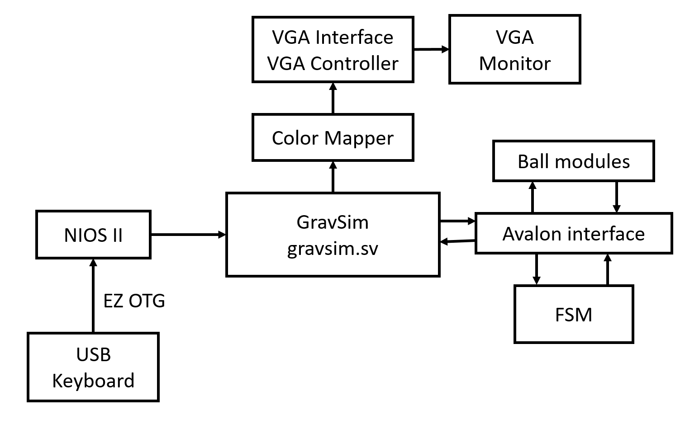
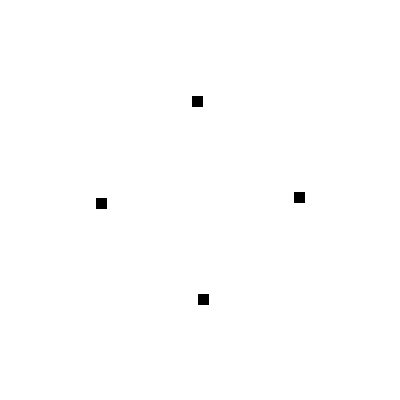
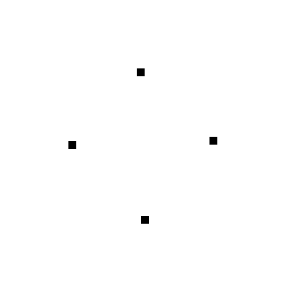
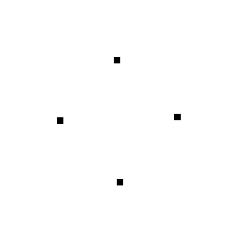
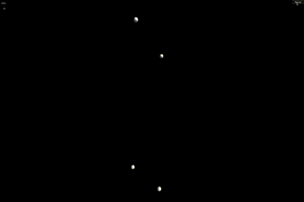
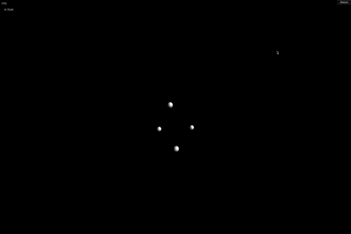

# GravSim

A gravitational simulation of the N-body problem using hardware acceleration from a FPGA.

## Overview
It is generally known that the famous n-body problem (see https://en.wikipedia.org/wiki/N-body\_problem) cannot be solved algebraically. The simulation of such a system is therefore a more pragmatic way of evaluating and predicting celestial movement. Our analysis shows that this problem has a computation complexity on the order of O(n^2) and each individual time-step can be simulated with the use of discrete mathematics. Although this variation of gravitational simulation is already well explored, the key difference between our project and existing implementations is that we use hardware-based acceleration from an FPGA to provide a remarkable boost in performance.

The simulation will first be written in software and run on the NIOS II for a baseline control performance. Afterwards, the gravitational calculations will be ported to the FPGA for a significant perfomance boost. In both cases we will be using a VGA monitor to display the simulation.  User input will be taken from the USB keyboard, and will control the start/pause/reset of the simulation. The NIOS II processor will be used for remaining software overhead. The Avalon MM interfaces between the NIOS II and the FPGA.

## Getting Started

### Prerequisites
Mac:
imagemagick (via homebrew)

### Installing
Download the project by navigating to the desired install directory and cloning this git repository using the command

`git clone https://github.com/scott0123/GravSim.git`

or

`git clone git@github.com:scott0123/GravSim.git`

### Running
Navigate to the code directory

`cd GravSim/code`

and use the command

`make`

This will compile the main.c file along with its dependencies.

Finally run the generated binary "test"

`./test`
## Demo (C Simulated)

## Demo (Unity simulated)

## Mathematics
All operations are done under a right-hand Cartesian coordinate system with

* the positive x direction pointing to the right of the screen
* the positive y direction pointing to the top of the screen
* the positive z direction protruding out of the screen

The model operates under the assumption that the only force each planetary body is subject to at any point in time is purely gravitational in nature. The only exception to this rule is when two bodies collide, at which point alternative forces will be present.

## Contributing
Our team currently does not accept outside contributions. For inquiries please contact `gravsim@scott-liu.com`

## License
This project is licensed under the MIT License.
You may copy, modify, and distribute it how you like.

## Acknowledgements
TODO
