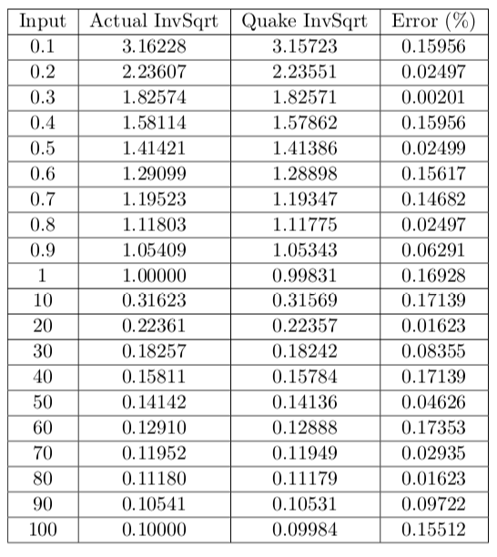

# GravSim

A gravitational simulation of the N-body problem using hardware acceleration from a FPGA.

## Introduction

### Purpose

Our team constructed a system in which the effect of gravity is simulated and imposed onto multiple planetary bodies in three dimensions.

We believe that this project, GravSim, may well be of practical significance. It is generally known that the famous n-body problem cannot be solved algebraically. The simulation of such a system is therefore a more pragmatic way of evaluating and predicting celestial movement. Our analysis showed that this problem has a computation complexity on the order of O(n^2) and each individual time-step could be simulated with the use of discrete mathematics. 

Although this variation of gravitational simulation has already been well explored, the key difference between our project and existing implementations is that we use hardware-based acceleration from an FPGA to provide a remarkable boost in performance.

### Design Overview

The simulation was first written in C and was run on the NIOS II for a performance baseline in software. The VGA monitor (as used in Lab 8) was configured to display the simulation. The gravity interaction calculations were then all ported over to the FPGA as an attempt to achieve a performance increase. User input from the USB keyboard (as in Lab 8) is taken to allow start/pause/reset of the simulation. The NIOS II was used for remaining software overhead such as initialization of the planet positions.The  Avalon MM Interface served as the bridge between the NIOS II and FPGA.

The difficulty of the project arose when we started to consider the numerical system in which we needed to perform calculations. We had a couple of options in front of us: we could use integers, fixed point numbers, or floating point numbers. However, both integers and fixed point numbers would be far too imprecise due to the nature of gravitational simulations. In particular, a small fluctuation in the past would cause errors that increase exponentially in the future. As a result, our team decided that we need the precision of 32 bit floating point numbers that adhere to the IEEE 754 floating point standards.

Unfortunately, there was no open source 32 bit floating point implementation for any hardware description languages such as SystemVerilog readily available online. Nevertheless, we did manage to salvage some work done on an implementation of different bit-length, and extended this into a working version of 32 bit IEEE 754.

## Finite State Machine

## Getting Started (Software)

### Prerequisites
Mac:
imagemagick (via homebrew)

### Installing
Download the project by navigating to the desired install directory and cloning this git repository using the command

`git clone https://github.com/scott0123/GravSim.git`

or

`git clone git@github.com:scott0123/GravSim.git`

### Running
Navigate to the C code directory

`cd GravSim/code`

and use the command

`make`

This will compile the main.c file along with its dependencies.

Finally run the generated binary "test"

`./test`

## Getting Started (Hardware)

### Prerequisites

* Altera Quartus (software)
* FPGA Cyclone series
* Keyboard
* VGA Monitor

### Installing

Download the project by navigating to the desired install directory and cloning this git repository using the command

`git clone https://github.com/scott0123/GravSim.git`

or

`git clone git@github.com:scott0123/GravSim.git`

### Running

Navigate to the SystemVerilog code directory

`cd GravSim/SV`

Open the Quartus file `GravSim.qpf`

Compile the hardware design in Quartus after setting `GravSim.sv` as the top level module.

Push the generated *sof* file onto the FPGA.

Run Eclipse and build the included `main.c` file.

Run the configuration.

## Demo (Hardware simulated)

## Demo (C Simulated)

## Demo (Unity simulated)

## Mathematics

### Overview

All operations are done under a right-hand Cartesian coordinate system with

* the positive x direction pointing to the right of the screen
* the positive y direction pointing to the top of the screen
* the positive z direction protruding out of the screen

The model operates under the assumption that the only force each planetary body is subject to at any point in time is purely gravitational in nature. The only exception to this rule is when two bodies collide, at which point alternative forces will be present. (This ended up being not implemented due to timing constraints)

### Numerical Methods

We utilized the famous inverse square root shortcut in hardware first discovered by the developers of Quake. Here is a table of the approximation errors for a range of inputs:

## Wave Simulation Diagrams

## Contributing

Our team currently does not accept outside contributions. Additionally, the project has officially ended on 03/05/2018. 

For inquiries please contact `gravsim@scott-liu.com`

## License

This project is licensed under the MIT License.
You may copy, modify, and distribute it how you like.

Please note that plagerism (especially in an academic context) is strictly forbidden. Please consult your supervisor if you wish to use any modules we have created.

## Acknowledgements

Main Authors

* Scott Liu
* Anish Bhattarcharya

Inspired by

* Skyler Schneider, Mark Eiding. *Simplified Floating Point for DSP Cyclone2 and Cyclone4*
* Abul Hasnat, Tanima Bhattacharyya, Atanu Dey, Santanu Halder, Debotosh Bhattacharjee. *A Fast FPGA Based Architecture for Computation of Square Root and Inverse Square Root*
* Altera Corporation. *Floating-Point IP Cores User Guide*
* mcleod_ideafix *Stack Overflow answer*